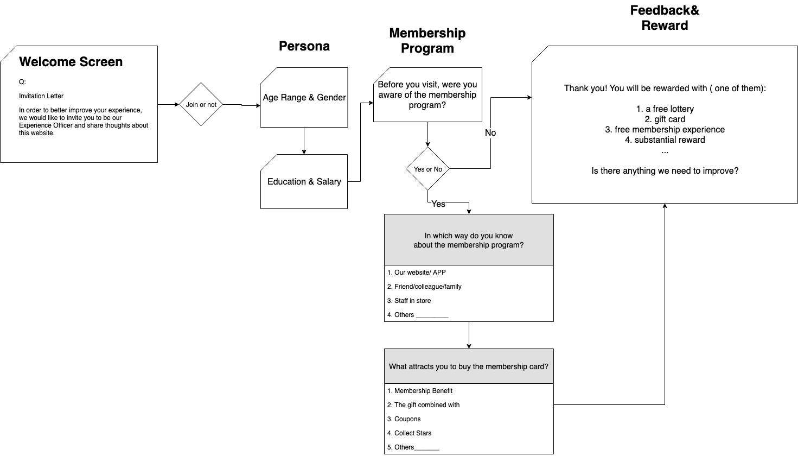

# Survey on Website
According to [Test 7 - On-page survey product design](https://github.com/Wiredcraft/test-designer/blob/master/Test%207%20-%20Design%20an%20on-page%20survey%20product.md#test-7----on-page-survey-product-design), Wiredcraft is helping clients collect feedback from on-page survey in order to find out pain points and discover opportunities to improve. 

Here I scale down the scope to focus on the membership propram, and to optimize the survey experience on it.

## Membership Program
In terms of the Membership Program, we need to learn from users about the basic using status quos, and get insights from them. So that the client are able to know how to better incentive users' participation on the products and get more long-term members. 

## Our Requirement
In order to get basic information we want their basic peronas, habitat on membership and perference of card's application.

## Questionnaire
From the client side, what we should help them is to establish the basic persona of their users(age, gender, region, salary, education). What's more, as on membership program, the habitat of consuming and user's perference are quiet important. 

Before designing the questionnare, there are 4 points to follow:

  - Simple
  - Neutral
  - Fluent
  - Incentive

Based on the demo data sheet, I set up my own basic information architecture.

### Information Architecture

